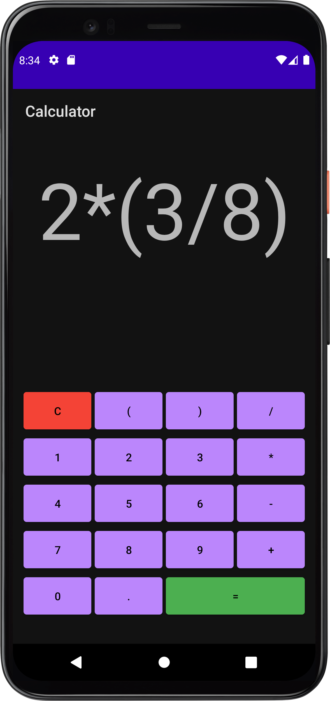

# Basic Calculator
4 Function Calculator built in Android Studio/Java.
Features:
- Dark Mode Support
  - Uses System setting
- Order of Operations
- Material Design
- Shows full function, not per step (like the iOS calculator)

